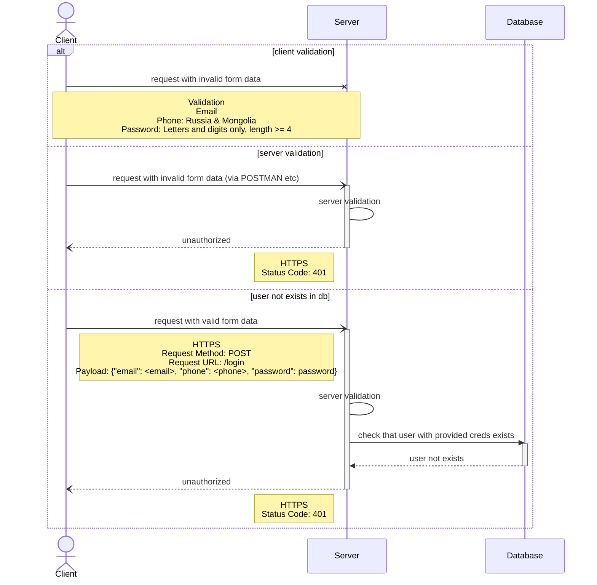

```mermaid
sequenceDiagram
  actor Client
  participant Server
  participant Database

  alt client validation
    Client-xServer: request with invalid form data
    Note over Client, Server: Validation <br> Email <br> Phone: Russia & Mongolia <br> Password: Letters and digits only, length >= 4
  else server validation
    Client-)Server: request with invalid form data (via POSTMAN etc)
    activate Server
    Server->Server: server validation
    Server--)Client: unauthorized
    deactivate Server
    Note left of Server: HTTPS <br> Status Code: 401
  else user not exists in db
    Client-)Server: request with valid form data
    activate Server
    Note right of Client: HTTPS <br> Request Method: POST <br> Request URL: /login <br> Payload: {"email": <email>, "phone": <phone>, "password": password}

    Server->Server: server validation
    Server->>Database: check that user with provided creds exists
    activate Database

    Database-->>Server: user not exists
    deactivate Database

    Server--)Client: unauthorized
    deactivate Server
    Note left of Server: HTTPS <br> Status Code: 401
  end
```
