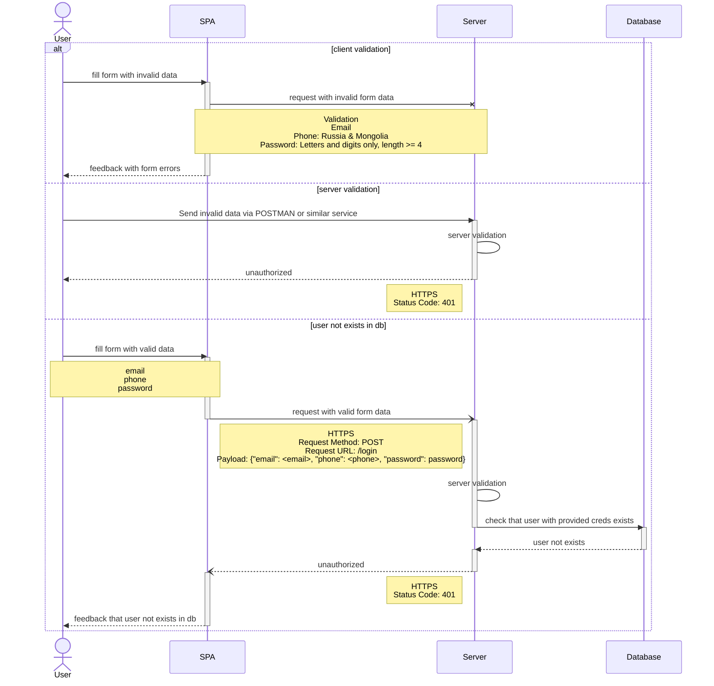

```mermaid
sequenceDiagram
  actor User
  participant SPA
  participant Server
  participant Database

  alt client validation
    User->>SPA: fill form with invalid data

    activate SPA
    SPA-xServer: request with invalid form data
    Note over SPA, Server: Validation <br> Email <br> Phone: Russia & Mongolia <br> Password: Letters and digits only, length >= 4
    SPA-->>User: feedback with form errors
    deactivate SPA
  else server validation
    User->>Server: Send invalid data via POSTMAN or similar service

    activate Server
    Server->Server: server validation
    Server-->>User: unauthorized
    deactivate Server
    Note left of Server: HTTPS <br> Status Code: 401
  else user not exists in db
    User->>SPA: fill form with valid data

    activate SPA
    Note over User, SPA: email <br> phone <br> password
    SPA-)Server: request with valid form data
    deactivate SPA

    activate Server
    Note right of SPA: HTTPS <br> Request Method: POST <br> Request URL: /login <br> Payload: {"email": <email>, "phone": <phone>, "password": password}
    Server->Server: server validation
    Server->>Database: check that user with provided creds exists
    deactivate Server

    activate Database
    Database-->>Server: user not exists
    deactivate Database

    activate Server
    Server--)SPA: unauthorized
    deactivate Server
    

    activate SPA
    Note left of Server: HTTPS <br> Status Code: 401
    SPA-->>User: feedback that user not exists in db
    deactivate SPA
  end
```
