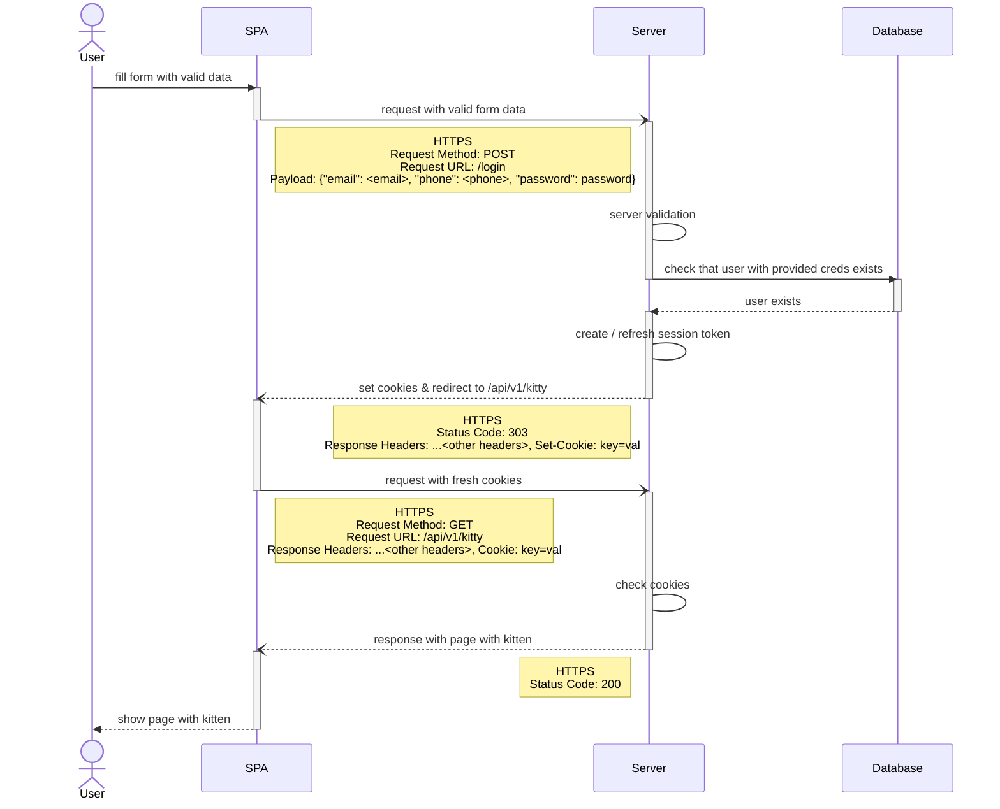

```mermaid
sequenceDiagram
  actor User
  participant SPA
  participant Server
  participant Database

  User->>SPA: fill form with valid data

  activate SPA
  SPA-)Server: request with valid form data
  deactivate SPA

  activate Server
  Note right of SPA: HTTPS <br> Request Method: POST <br> Request URL: /login <br> Payload: {"email": <email>, "phone": <phone>, "password": password}
  Server->Server: server validation
  Server->>Database: check that user with provided creds exists
  deactivate Server

  activate Database
  Database-->>Server: user exists
  deactivate Database

  activate Server
  Server->Server: create / refresh session token
  Server--)SPA: set cookies & redirect to /api/v1/kitty
  deactivate Server

  activate SPA
  Note left of Server: HTTPS <br> Status Code: 303 <br> Response Headers: ...<other headers>, Set-Cookie: key=val
  SPA-)Server: request with fresh cookies
  deactivate SPA

  activate Server
  Note right of SPA: HTTPS <br> Request Method: GET <br> Request URL: /api/v1/kitty <br> Response Headers: ...<other headers>, Cookie: key=val
  Server->Server: check cookies
  Server--)SPA: response with page with kitten
  deactivate Server

  activate SPA
  Note left of Server: HTTPS <br> Status Code: 200
  SPA-->>User: show page with kitten
  deactivate SPA

```
