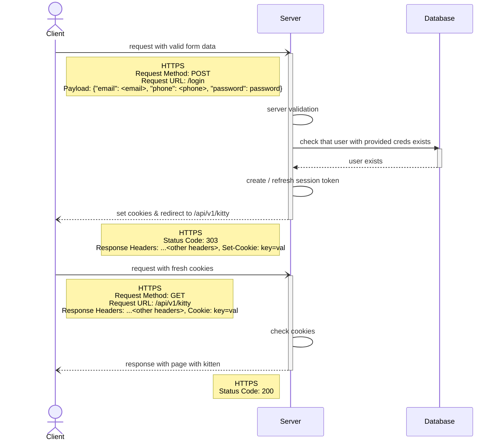

```mermaid
sequenceDiagram
  actor Client
  participant Server
  participant Database

  Client-)Server: request with valid form data
  activate Server
  Note right of Client: HTTPS <br> Request Method: POST <br> Request URL: /login <br> Payload: {"email": <email>, "phone": <phone>, "password": password}
  
  Server->Server: server validation

  Server->>Database: check that user with provided creds exists
  activate Database
  Database-->>Server: user exists
  deactivate Database

  Server->Server: create / refresh session token
  Server--)Client: set cookies & redirect to /api/v1/kitty
  deactivate Server
  Note left of Server: HTTPS <br> Status Code: 303 <br> Response Headers: ...<other headers>, Set-Cookie: key=val
  
  Client-)Server: request with fresh cookies
  activate Server
  Note right of Client: HTTPS <br> Request Method: GET <br> Request URL: /api/v1/kitty <br> Response Headers: ...<other headers>, Cookie: key=val

  Server->Server: check cookies
  Server--)Client: response with page with kitten
  deactivate Server
  Note left of Server: HTTPS <br> Status Code: 200
```
